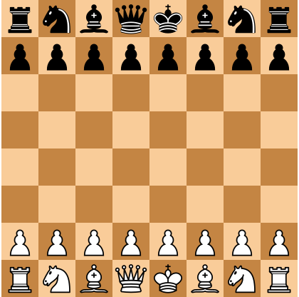

### Activity: Recreating a Chessboard Homepage with CSS Grid

**Objective**: To utilize CSS Grid layout techniques to recreate a chessboard homepage with the ability to choose your own color scheme.

**Tasks**:
1. **Examine the Chessboard Layout**:
    - Look at the provided chessboard image to understand the layout you need to recreate.
    - Pay attention to the placement of each piece on the board.
    - : The chessboard to be reproduced.

2. **Prepare Your Files**:
    - Use the provided `index.html` for the webpage's structure.
    - Use the provided `styles.css` for styling your layout.
    - Images of chess pieces are in the `chess-pieces` folder.

3. **Create the Grid**:
    - In `styles.css`, use **`display: grid`** to define the grid container for the chessboard.
    - Define an 8x8 grid

4. **Style the Chessboard**:
    - Choose a color scheme for the chess squares and style them using CSS.
    - Ensure the grid cells are sized correctly to fit the pieces and the overall layout is responsive.

5. **Position the Pieces**:
    - Place each chess piece image in the correct grid cell using CSS.

6. **Styling Considerations**:
    - Feel free to creatively style the webpage while maintaining the chessboard's integrity.
    - Ensure that the final design is visually appealing and aligns with the original layout.
